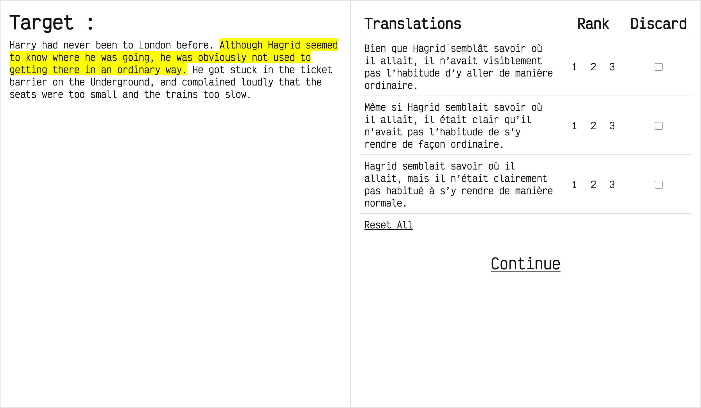
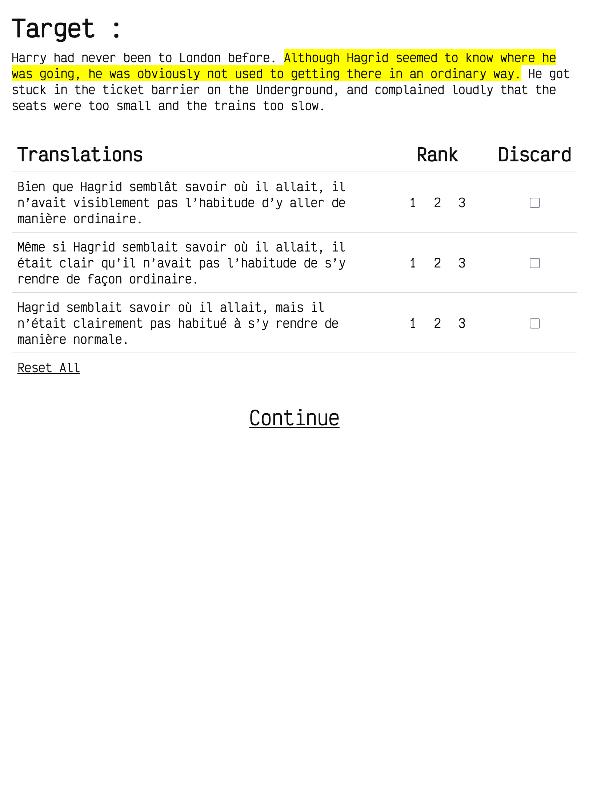
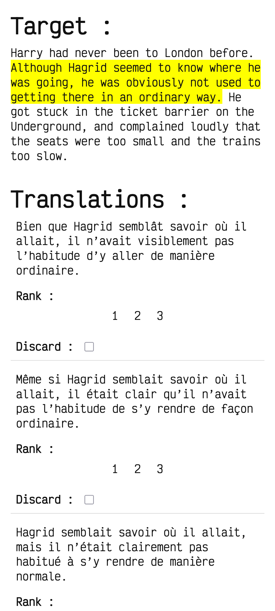

# 🌐 Translation Feedback WebApp

**Web application for collecting and managing translation feedback with an intuitive user interface and a backend API.**

---

## 🏗️ Architecture

### Frontend
- **React 18** with **TypeScript** 
- Responsive design with CSS modules/styled-components

### Backend
- **Flask** 
- **SQLite**

### 📁 Project Structure

```
translation_feedback_app/
├── apps/
│   ├── feedback_api/         # Flask backend
│   │   ├── main.py           # Application entry point
│   │   ├── requirements.txt  # Python dependencies
│   │   ├── .venv/            # Virtual environment
│   │   └── ...
│   └── evaluator_ui/         # React frontend
│       ├── src/              # Source code
│       ├── package.json      # Node dependencies
│       ├── tsconfig.json     # TypeScript configuration
│       └── ...
├── README.md
└── ...
```

---

## 🚀 Quick Start

### Prerequisites

Make sure you have the following installed:
- **Python 3.8+**
- **Node.js 16+**
- **npm** or **yarn**
- **Git**

### Installation

1. **Clone the repository**
   ```bash
   git clone https://github.com/gri-sha/translation_feedback_app.git
   cd translation_feedback_app
   ```

2. **Set up the Backend**
   ```bash
   cd apps/feedback_api
   
   # Create and activate virtual environment
   python3 -m venv .venv
   source .venv/bin/activate  # On Windows: .venv\Scripts\activate
   
   # Install dependencies
   pip install -r requirements.txt
   
   # Start the Flask server
   python3 main.py
   ```
   
   The API will be running at `http://localhost:5000`

3. **Set up the Frontend**
   
   Open a new terminal window:
   ```bash
   cd apps/evaluator_ui
   
   # Install dependencies
   npm install
   
   # Start the development server
   npm run dev
   ```
   
   The application will be available at `http://localhost:5173`

---

## 📸 Gallery



